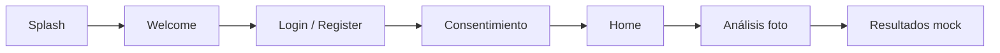

# DermaCheck

Demo académica: app móvil para **análisis dermatológico preliminar** (simulado), con **registro/login**, **consentimiento y privacidad** persistidos en servidor cuando hay API, y flujo de foto → informe mock.

---

## Tecnologías que usa el proyecto

### Aplicación móvil (carpeta raíz + `src/`)

| Tecnología | Uso |
|------------|-----|
| **React Native** | UI nativa iOS/Android |
| **Expo SDK 55** | Toolchain, desarrollo y Expo Go |
| **TypeScript** | Tipado en todo el frontend |
| **React Navigation 7** | Navegación en stack (`@react-navigation/native`, `native-stack`) |
| **react-native-screens** | Pantallas nativas optimizadas |
| **react-native-safe-area-context** | Márgenes seguros (notch, barra home) |
| **expo-image-picker** | Cámara y galería |
| **expo-status-bar** | Barra de estado |
| **Context API** | Estado global (usuario, consentimiento, análisis) |
| **@react-native-async-storage/async-storage** | Sesión y cuentas en modo sin API |

### Backend (`backend/`)

| Tecnología | Uso |
|------------|-----|
| **Python 3.11+** | Lenguaje del API |
| **FastAPI** | Endpoints REST, validación automática |
| **Uvicorn** | Servidor ASGI |
| **SQLAlchemy 2.0** | ORM y modelos de datos |
| **SQLite** (por defecto) | Archivo `dermacheck.db` en `backend/` (sin instalar servidor) |
| **PyMySQL** (opcional) | Conexión a **MySQL** si cambias `DATABASE_URL` |
| **Pydantic v2** | Esquemas de entrada/salida del API |
| **pydantic-settings** | Variables desde `.env` |
| **python-dotenv** | Carga de entorno |
| **bcrypt** | Hash **unidireccional** de contraseñas (12 rondas); solo el hash se guarda en `app_users` |

### Integración app ↔ servidor

| Concepto | Detalle |
|----------|---------|
| **Variable `EXPO_PUBLIC_API_BASE_URL`** | URL base del FastAPI (en `.env` en la **raíz** del repo). Si está vacía, la app no llama al backend para auth/consent. |
| **CORS** | El API permite orígenes amplios en desarrollo para que el móvil pueda llamar por HTTP. |

---

## IP del PC y Expo Go (imprescindible para guardar en la base de datos)

Para que **registro, login y consentimiento** se persistan en **SQLite/MySQL del servidor**, el teléfono debe poder **alcanzar tu ordenador por red**. Eso solo funciona si:

1. **PC y móvil están en la misma red WiFi** (no datos móviles en el teléfono salvo que hagas tú el enrutado).
2. Obtienes la **IPv4 del PC** (no la IPv6 larga):
   - Windows: `ipconfig` → busca **“Adaptador de LAN inalámbrica Wi-Fi”** (o similar) → **Dirección IPv4** (ej. `192.168.0.15`).
3. En la **raíz del repo** (carpeta `DermaCheck`, donde está `package.json` de la app), archivo **`.env`**:
   ```env
   EXPO_PUBLIC_API_BASE_URL=http://192.168.0.15:8000
   ```
   Sustituye por **tu** IPv4. **Sin barra final.** Puerto **8000** si usas el comando de `uvicorn` de este README.
4. **No pongas `http://localhost:8000`** si pruebas con **Expo Go en un dispositivo físico**: `localhost` en el móvil es el propio teléfono, no tu PC.
5. El backend debe arrancar con **`--host 0.0.0.0`** para aceptar conexiones desde la red local, no solo desde el PC.
6. Tras editar `.env`, **reinicia Metro** (`Ctrl+C` y `npx expo start`).

**Comprobación rápida:** con el API en marcha, en el **navegador del móvil** abre `http://TU_IP:8000/health`. Si ves `{"status":"ok"}`, la red está bien; luego la app Expo también podrá hablar con el API.

---

## Contraseñas: hash seguro en el servidor

- En el **backend**, las contraseñas **nunca** se guardan en texto claro.
- Se usa **bcrypt** (`bcrypt` en Python) con **12 rondas** de coste (`BCRYPT_ROUNDS` en `backend/app/routers/auth.py`).
- En base de datos solo existe **`password_hash`** (cadena bcrypt, incluye salt).
- El **login** compara la contraseña enviada con `bcrypt.checkpw` contra ese hash.
- La app móvil envía la contraseña **solo por HTTPS en producción**; en clase suele usarse HTTP en LAN (solo para demo).

**Modo sin API** (sin `EXPO_PUBLIC_API_BASE_URL`): el registro mock puede guardar la contraseña en **AsyncStorage en claro** solo en el dispositivo; no uses eso como modelo de producción.

---

## Paso a paso: dejar todo funcionando

Sigue el orden. Necesitas **dos terminales** abiertas al final (backend + Expo).

### Paso 0 — Requisitos en tu máquina

- [Node.js](https://nodejs.org/) (LTS) y npm  
- [Python](https://www.python.org/) 3.11 o superior  
- WiFi: **PC y móvil en la misma red** (si usas Expo Go en físico)  
- En el móvil: **Expo Go** compatible con **Expo SDK 55** (o el cliente que use tu equipo)

### Paso 1 — Clonar o abrir el proyecto

```bash
cd DermaCheck
npm install
```

### Paso 2 — Backend: entorno y dependencias

```bash
cd backend
python -m venv venv
```

**Windows (PowerShell):**

```powershell
.\venv\Scripts\Activate.ps1
pip install -r requirements.txt
```

Si no tienes `.env` en `backend/`, créalo copiando el ejemplo:

```powershell
copy .env.example .env
```

Dentro de `backend/.env` debe existir al menos:

```env
DATABASE_URL=sqlite:///./dermacheck.db
```

(Eso usa **SQLite local**: se creará el archivo `dermacheck.db` al arrancar el API.)

### Paso 3 — Arrancar el API

Con el venv activado y estando en `backend/`:

```bash
uvicorn app.main:app --reload --host 0.0.0.0 --port 8000
```

Comprueba en el navegador del PC:

- [http://127.0.0.1:8000/health](http://127.0.0.1:8000/health) → debe responder `{"status":"ok"}`  
- [http://127.0.0.1:8000/docs](http://127.0.0.1:8000/docs) → documentación Swagger  

**Importante:** `--host 0.0.0.0` hace que el móvil en la WiFi pueda llamar por IP a tu PC.

### Paso 4 — IP del PC para el móvil

En **Windows**, en PowerShell:

```powershell
ipconfig
```

Anota la **IPv4** del adaptador WiFi (ejemplo: `192.168.0.15`).

### Paso 5 — Configurar Expo (raíz del repo, no `backend/`)

En la carpeta **DermaCheck** (donde está `package.json` de la app), crea o edita el archivo **`.env`**:

```env
EXPO_PUBLIC_API_BASE_URL=http://TU_IP_V4:8000
```

Ejemplo:

```env
EXPO_PUBLIC_API_BASE_URL=http://192.168.0.15:8000
```

- Sin barra al final.  
- **No uses `localhost`** aquí si pruebas con Expo Go en un teléfono: el teléfono interpretaría “él mismo”, no tu PC.

### Paso 6 — Arrancar la app

En la **raíz** del proyecto (nueva terminal):

```bash
npx expo start
```

Escanea el QR con Expo Go o abre en emulador.

**Si cambias `.env`**, cierra Metro (`Ctrl+C`) y vuelve a ejecutar `npx expo start`.

### Paso 7 — Probar el flujo

1. Registro → debería crear usuario en SQLite (`app_users`).  
2. Consentimiento (dos checkboxes) → registra filas en `user_document_acceptances`.  
3. En **Inicio** → **Ver documentos aceptados** → lista desde el API.  

Puedes inspeccionar datos con un visor SQLite sobre `backend/dermacheck.db` o desde `/docs` con los endpoints.

---

## Cómo funciona (visión general)

### Dos modos de operación

1. **Con API** (`EXPO_PUBLIC_API_BASE_URL` definida y backend en marcha)  
   - **Registro / login** → `POST /api/v1/auth/register` y `POST /api/v1/auth/login`.  
   - Usuarios y contraseñas (hash) en tabla **`app_users`** en la base (SQLite o MySQL).  
   - **Consentimiento** → `POST /api/v1/consents/accept` con el `id` del usuario.  
   - Se guardan aceptaciones en **`user_document_acceptances`**, con fecha/hora del **servidor** (UTC).  
   - Los textos legales vigentes están en **`legal_documents`** (semilla al iniciar).  
   - La app sigue guardando **sesión** (usuario + consentimiento) en AsyncStorage para no pedir login en cada apertura, pero la **fuente de verdad** de cuentas y aceptaciones es el servidor.

2. **Sin API** (sin variable o backend apagado)  
   - **Registro / login** → solo **AsyncStorage** en el teléfono (demo offline).  
   - **Consentimiento** → simulado en el cliente (sin MySQL/SQLite en servidor).  
   - Útil para enseñar UI sin montar Python.

### Flujo de pantallas (resumen)



### Dónde vive cada dato (modo con API)

| Dato | Dónde |
|------|--------|
| Usuario (email, nombre, hash contraseña) | Tabla `app_users` en `dermacheck.db` |
| Catálogo legal (slug, título, versión) | Tabla `legal_documents` |
| “Quién aceptó qué y cuándo” | Tabla `user_document_acceptances` |
| Sesión recordada en el móvil | AsyncStorage (usuario + estado consentimiento) |

El `user_id` que envía la app al endpoint de consentimientos es el **mismo `id`** devuelto al registrar o iniciar sesión.

---

## Endpoints del API (`/api/v1`)

| Método | Ruta | Descripción |
|--------|------|-------------|
| `POST` | `/auth/register` | Crea usuario (email único, contraseña hasheada) |
| `POST` | `/auth/login` | Valida credenciales; devuelve `user` |
| `POST` | `/consents/accept` | Registra aceptaciones de documentos |
| `GET` | `/consents/users/{user_id}/acceptances` | Lista aceptaciones de ese usuario |

Prefijo completo ejemplo: `http://192.168.x.x:8000/api/v1/...`

---

## Estructura del repositorio

```
DermaCheck/
├── App.tsx
├── package.json
├── .env                    ← EXPO_PUBLIC_API_BASE_URL (raíz; ver .gitignore)
├── src/
│   ├── screens/
│   ├── navigation/
│   ├── services/           ← authService, consentService (HTTP o mock)
│   ├── context/
│   ├── components/
│   └── ...
├── backend/
│   ├── app/
│   │   ├── main.py
│   │   ├── models.py       ← AppUser, LegalDocument, UserDocumentAcceptance
│   │   ├── routers/        ← auth, consent
│   │   └── ...
│   ├── requirements.txt
│   ├── .env                ← DATABASE_URL (solo backend)
│   └── dermacheck.db       ← se genera al usar SQLite (no subir a git)
└── README.md
```

Más detalle de **MySQL vs SQLite** en [backend/README.md](backend/README.md).

---

## Problemas frecuentes

| Síntoma | Qué revisar |
|---------|-------------|
| El móvil no conecta al API | Misma WiFi, IP correcta en `.env` raíz, firewall permite puerto 8000, `uvicorn` con `--host 0.0.0.0` |
| Expo no usa la URL del API | `.env` en la **raíz** del proyecto Expo, no dentro de `backend/`; reiniciar Metro |
| Error al instalar bcrypt / passlib | Actualizar pip; en Windows suele resolverse con wheels precompilados |
| Expo Go “SDK incompatible” | Instalar Expo Go para SDK 55 o el APK que indique la documentación de Expo |

---

## Aviso académico

No es un producto médico ni legalmente completo. Los textos legales son resumen de demo. En **modo con API**, las contraseñas en servidor van con **bcrypt** (hash); en **modo sin API**, las cuentas mock pueden guardarse en claro **solo en el dispositivo**.
